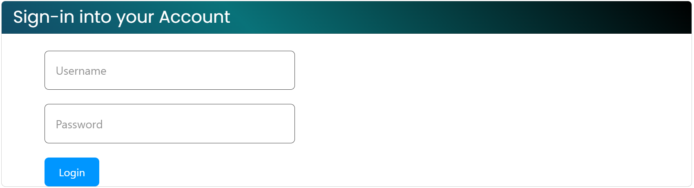
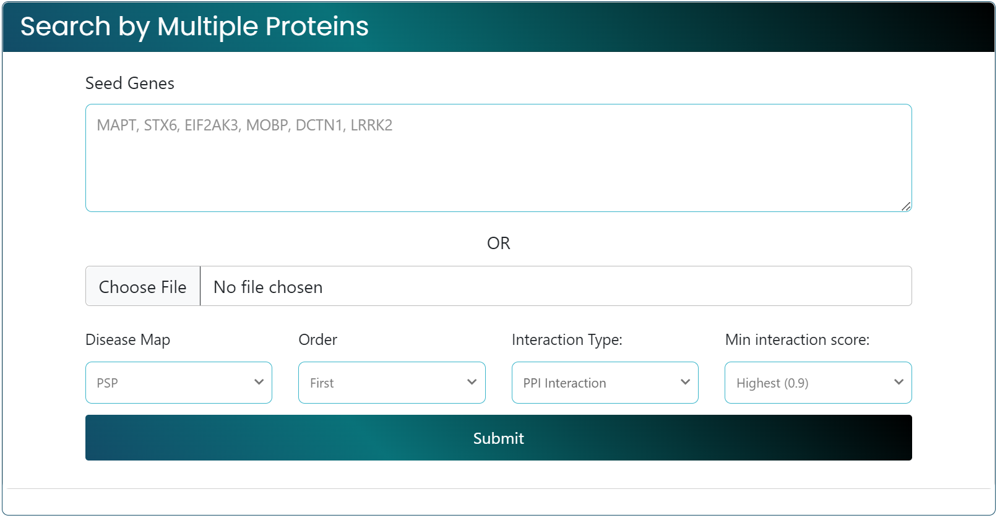
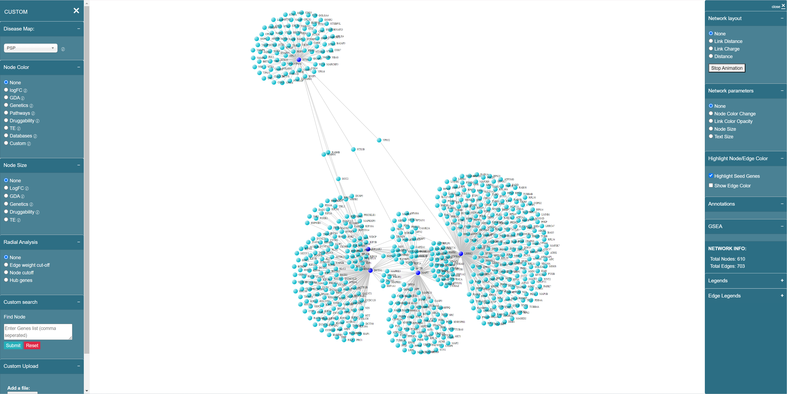

# Overview

### **Getting Started**

Welcome to the **Getting Started Guide** for Interactive Network Visualization tool! Here you will find all the necessary steps to get started with our platform.

### Step 1: Logging In

Log in with your credentials by following these steps:

1. Go to the login page.
2. Enter your username and password.
3. Click the "Login" button.

<figure><figcaption>
Login page
</figcaption></figure>

### Step 2: Navigating the Dashboard

After logging in, you will be taken to the dashboard. Here’s a quick overview:

* **By protein name**: Enter gene names or Ensembl IDs to generate the network. You can find detailed explanation on the page of [Dashboard - By protein name](dashboard/by-protein-name.md).

<figure><figcaption>
Search by Multiple Proteins
</figcaption></figure>

* **Upload a file**: Upload a network file to generate the network. You can find detailed explanation on the page of [Dashboard - Upload a file](dashboard/upload-a-file.md).

<figure><figcaption>
Custom network file upload
</figcaption></figure>

### Step 3: Rendering the Network Visualization

Once deciding the network, our platform will render the network based on your selections. Here is what you can expect on network visualization page:

* **Left panel**: Provides basic functions to analyze the network. You can find detailed explanation on the page of [Network Visualization - Left panel](network-visualization/left-panel.md).
* **Right panel**: Provides advanced functions and modifies the network settings. You can find detailed explanation on the page of [Network Visualization - Right panel](network-visualization/right-panel.md).

<figure><figcaption>
Network visualization page
</figcaption></figure>

#### Common Issues

If you encounter any issues, check our [FAQ page](faq.md). You can also check [Short Help Videos](use-cases-and-help-videos.md) for a quick hands-on.
