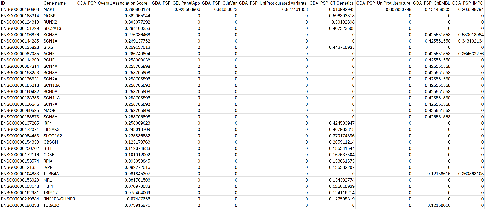
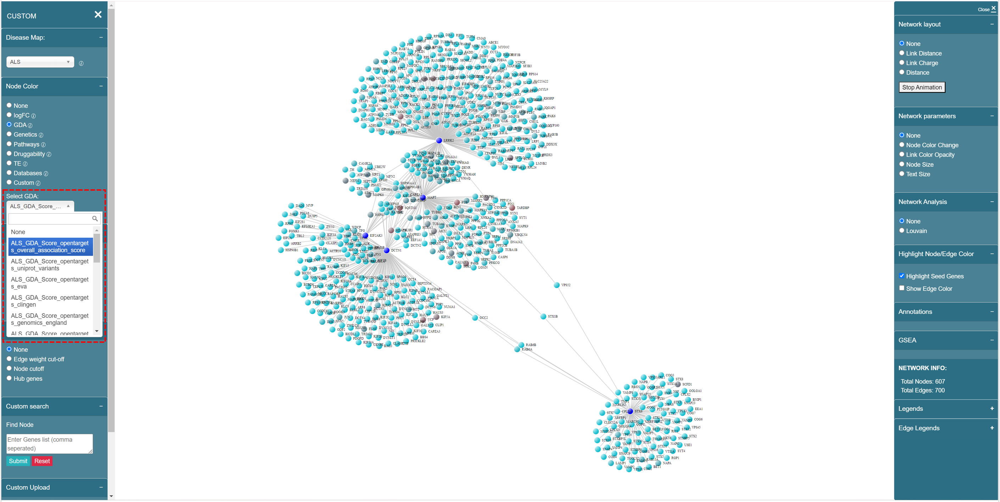

# GDA

Gene disease association score is from Open Targets portal. It qualifies the strength of the association between a gene and a disease. This score is derived using a combination of evidence from diverse data sources, e.g. genetic studies, transcriptomics, somatic mutations, drugs and pathways, etc.

We have 4 different diseases — PSP, ALS, FTD and OI.

## PSP & FTD

The PSP and FTD data in Open Targets is shown as below, where you can see the scores of different gene-disease association combinations.

<figure><figcaption>
PSP data in Open Targets platform
</figcaption></figure>

We transformed the data from Open Targets into the CSV format below, then inserted into our knowledge base.&#x20;

<figure><figcaption>
GDA data in our knowledge base
</figcaption></figure>

The naming convention of GDA data in the knowledge base follows the format of **{disease name}\_{"GDA"}\_{gene-disease association type}**, for example, "PSP\_GDA\_OT Crispr validation", shown as below:

<figure><figcaption>
PSP &#x26; FTD GDA data naming convention
</figcaption></figure>

## ALS & OI

ALS and OI GDA data are also from Open Targets, but the name convention is slightly different from PSP and FTD data. We use **{disease name}\_{"GDA"}\_{"Score"}\_{"opentargets"}\_{gene-disease association type}** as the format. For example, "ALS\_GDA\_Score\_opentargets\_overall\_association\_score", shown as below:

<figure><figcaption>
ALS &#x26; OI GDA data naming convention
</figcaption></figure>
