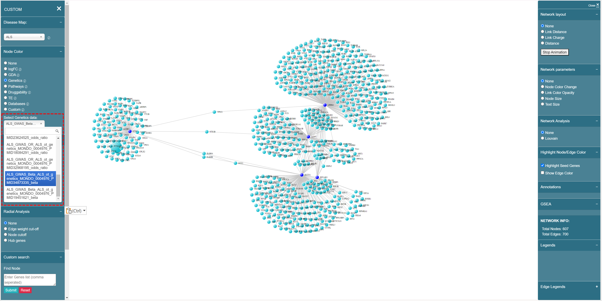

# Genetics

Genetic data in knowledge base is imported from Open Targets portal, and NHGRI GWAS catalog. The data is formatted to map SNPs level statistics to gene-level statistics i.e. odd-ratio or beta-value.

We have 4 different diseases — PSP, ALS, FTD and OI.

## PSP

## FTD

## ALS & OI

ALS and OI Genetics data are from Open Targets. We use **{disease name}\_{"GWAS"}\_{**_**score type**_**}\_{source}\_{disease id}\_{publication id}** as the format, for example, “GWAS\_beta\_otgenetics\_MONDO0004976\_PMID19451621”, shown as below:

<figure><figcaption>
ALS &#x26; OI Genetics data naming convention
</figcaption></figure>
