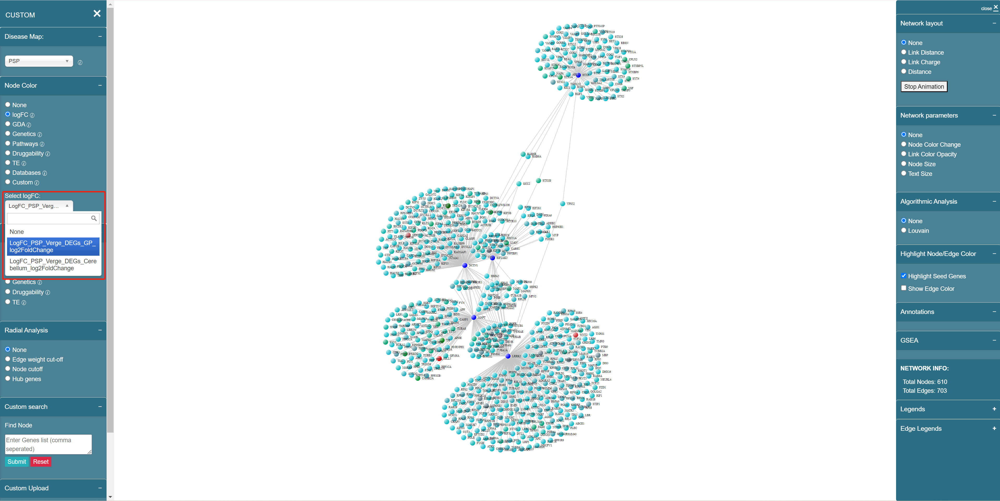

# LogFC

Differential expression results for disease vs control are calculated based on transcriptomic and Proteomic data and is available from knowledge base in the form of log2-fold change.

There are 2 types of LogFC data available in our tool -- Verge data and AD (Alzheimer’s Disease) data. Let's take the data of PSP disease as an example.

* Verge data

The summary of Verge data is listed below:

| Condition                            | No. of Sample |
| ------------------------------------ | ------------- |
| Control (Ctrl)                       | 72            |
| Progressive Supranuclear Palsy (PSP) | 78            |

| Tissue name     | Abbreviation |
| --------------- | ------------ |
| Cerebellum      | CBE          |
| Globus Pallidus | GP           |

| Dataset | Constrasts                             |
| ------- | -------------------------------------- |
| Verge   | Diagnosis-tissue wise (PSP Vs Control) |

You can use the Verge data to color or resize the nodes in the network. The name in the dropdown list of LogFC Verge data follows the format of **{"LogFC"}\_{disease name}\_{data type}\_{"DEGS"}\_{tissue Abbr.}\_{"log2FoldChange"}**, for example, "LogFC\_PSP\_Verge\_DEGS\_GP\_log2FoldChange", shown as below:

<figure><figcaption>
LogFC Verge data naming convention
</figcaption></figure>

* AD (Alzheimer’s Disease) data

The summary of AD data is listed below:

<table><thead><tr><th width="130">Brain Bank</th><th width="287">Description</th><th width="387">Brain Region</th></tr></thead><tbody><tr><td>Mayo</td><td>Study of Alzheimer’s disease and related dementias on donors from the Mayo Clinic Brain Bank and Banner Health</td><td><table data-header-hidden><thead><tr><th></th></tr></thead><tbody><tr><td>Cerebellum (CBE)</td></tr><tr><td>Temporal cortex (TCX)</td></tr></tbody></table></td></tr><tr><td>ROSMAP</td><td>Two longitudinal studies of aging and Alzheimer’s disease with brain donation upon death - The Religious Order Study (ROS) and Memory and Aging Project (MAP) run by Rush Alzheimer’s Disease Center.</td><td><table data-header-hidden><thead><tr><th></th></tr></thead><tbody><tr><td>Dorsolateral prefrontal cortex (DLPFC)</td></tr><tr><td>Posterior cingulate cortex (PCC)</td></tr><tr><td>Anterior cingulate cortex (ACC)</td></tr></tbody></table></td></tr><tr><td>MSBB</td><td>Study of Alzheimer’s disease on donors from the Mount Sinai/JJ Peters VA Medical Center NIH Brain and Tissue Repository</td><td><table data-header-hidden><thead><tr><th></th></tr></thead><tbody><tr><td>Frontal pole (FP)</td></tr><tr><td>Inferior frontal gyrus (IFG)</td></tr><tr><td>Parahippocampal gyrus (PHG)</td></tr><tr><td>Prefrontal cortex (PFC)</td></tr><tr><td>Superior temporal gyrus (STG)</td></tr></tbody></table></td></tr></tbody></table>

<table><thead><tr><th width="129">Brain Bank</th><th width="204">Brain Region</th><th width="203">Contrasts</th><th>Annotation</th></tr></thead><tbody><tr><td>Mayo</td><td>CBE, TCX</td><td>Diagnosis-tissue wise (AD Vs Control)</td><td>ADvsCtrl</td></tr><tr><td>MSBB</td><td>FP, IFG, PHG, PFC, STG</td><td>Diagnosis-tissue wise (AD Vs Control)</td><td>ADvsCtrl</td></tr><tr><td>MSBB</td><td>FP, IFG, PHG, PFC, STG</td><td>Diagnosis-tissue-gender (AD Vs Control)</td><td>
ADFemalevsCtrlFemale

ADMalevsCtrlMale
</td></tr><tr><td>ROSMAP</td><td>DLPFC, PCC,ACC</td><td>Diagnosis-tissue wise (AD Vs Control)</td><td>ADvsCtrl</td></tr><tr><td>ROSMAP</td><td>DLPFC, PCC,ACC</td><td>Diagnosis-tissue-gender-age of death (AD Vs Control)</td><td>
ADFemalevsCtrlFemale_agedeath

ADMalevsCtrlMale_agedeath
</td></tr></tbody></table>

You can use the AD data to color or resize the nodes in the network. The name in the dropdown list of LogFC AD data follows the format of **{"LogFC"}\_{disease name}\_{contrast annotation}\_{brain bank}\_{brain region}**, for example, "logFC\_PSP\_ADvsCtrl\_Mayo\_CBE", shown as below:

