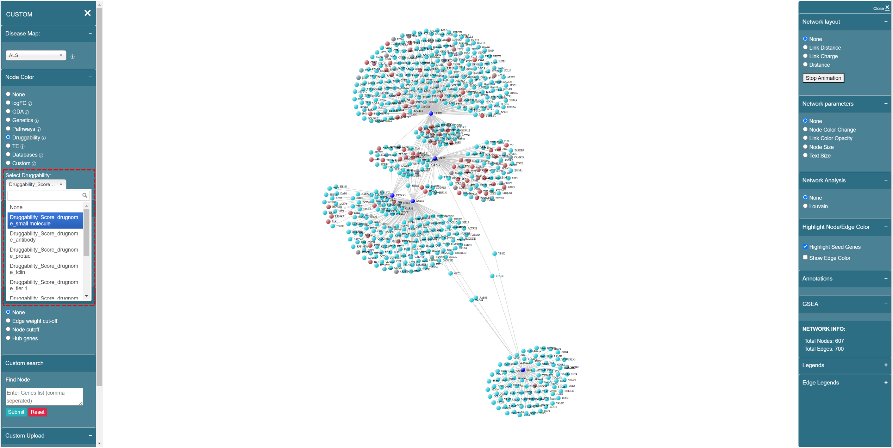

# Druggability

Druggability scores are derived directly from DrugnomeAI, it estimates the druggability likelihood for every protein-coding gene in the human exome [\[1\]](druggability.md#citation-1).

We use **{"Druggability"}\_{"Score"}\_{"drugnome"}\_{disease-agnostic/domain specific model}** as the format, for example, “Druggability\_Score\_drugnome\_small molecule”, shown as below:

<figure><figcaption>
Druggability data naming convention
</figcaption></figure>

#### Citation 1

> _\[1] Arwa et al. DrugnomeAI is an ensemble machine-learning framework for predicting druggability of candidate drug targets. Commun Biol 2022 Nov 24;5:1291. doi: 10.1038/s42003-022-04245-4_
