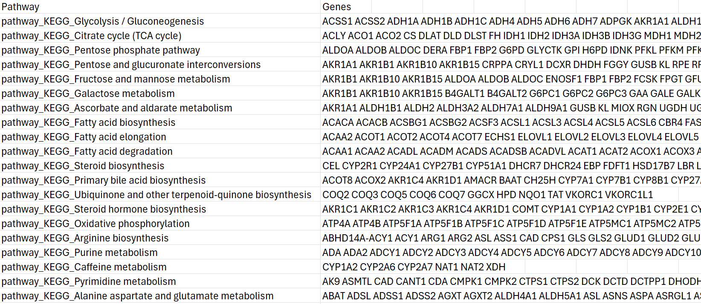
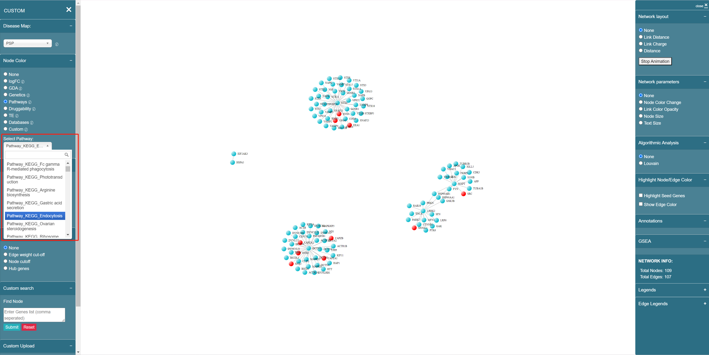

# Pathway

The knowledge base contains complete pathway data from **KEGG** and **Reactome** database. There are 360 pathways available in KEGG and 2725 pathways available in Reactome. This pathway information can be mapped on the network or executing real-time functional enrichment analysis from the interface. Each pathway contains different genes, and the original data looks like below:

<figure><figcaption>
Pathway-genes relationship
</figcaption></figure>

In Node Color section, when you click on a specific pathway name in the dropdown list of "Pathways" feature, you will see red colors rendered in the network, indicating the genes in the selected pathway. The name of each pathway follows the format of  **{"Pathway"}\_{database name}\_{pathway name}**, for example, "Pathway\_KEGG\_Endocytosis", shown as below:

<figure><figcaption>
Pathway name format
</figcaption></figure>
