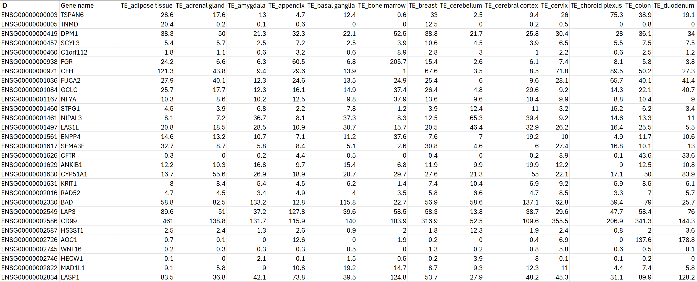
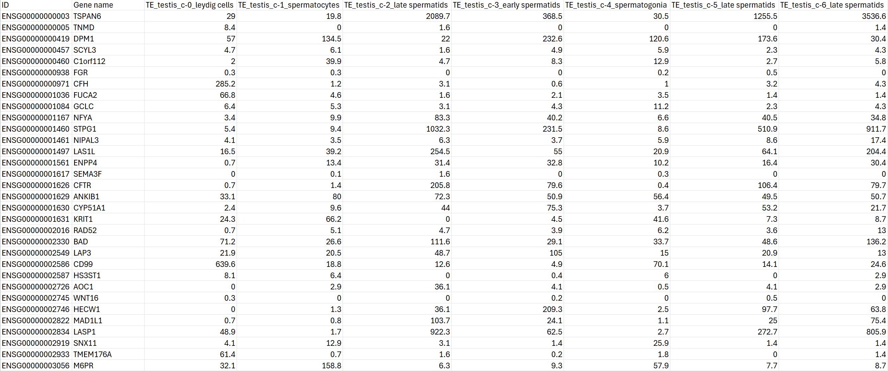
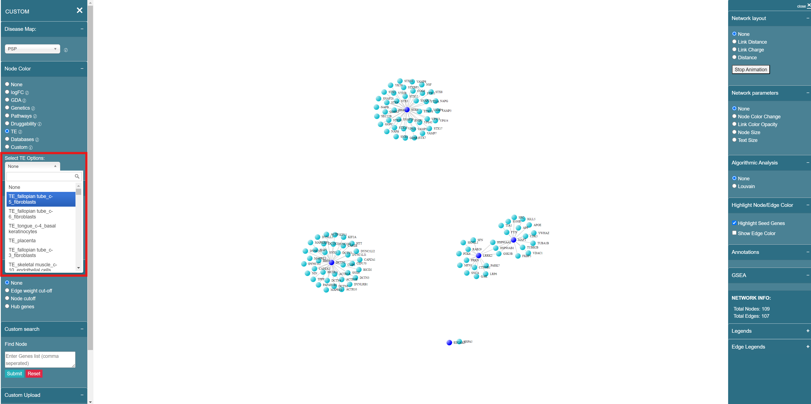

# Tissue Enrichment

Tissue-specific expression calculated from bulk RNA-seq and cell type specific expression data calculated from single nuclei RNA-seq is available in the knowledge base to extract information specific to a given tissue or cell type.

### Bulk RNA-seq

Data sources:

<table><thead><tr><th width="208">Data type</th><th>Count (tissues)</th><th width="187">Data</th><th>Coverage (nr genes)</th></tr></thead><tbody><tr><td>RNA expression (consensus)</td><td>50</td><td><a href="https://www.proteinatlas.org/humanproteome/tissue/data">Gene level RNA seq data based on 50 consensus tissues used for expression profiling and classification</a></td><td><a href="https://www.proteinatlas.org/search/tissue_category_rna%3AAny%3BTissue+enriched%2CGroup+enriched%2CTissue+enhanced%2CLow+tissue+specificity%2CNot+detected">20162</a></td></tr><tr><td>RNA expression (HPA)</td><td>40</td><td><a href="https://www.proteinatlas.org/humanproteome/tissue/data">Gene level RNA seq data based on the 40 tissues in the HPA dataset</a></td><td><a href="https://www.proteinatlas.org/search/tissue_category_rna%3AAny%3BTissue+enriched%2CGroup+enriched%2CTissue+enhanced%2CLow+tissue+specificity%2CNot+detected">20162</a></td></tr><tr><td>RNA expression (GTEx)</td><td>35</td><td>Gene level RNA seq data for 35 tissues based on 46 tissue subtypes in the GTEx dataset</td><td><a href="https://www.proteinatlas.org/search/has_data%3ATissue+-+GTEx+transcriptomics">19266</a></td></tr><tr><td>RNA expression (FANTOM)</td><td>46</td><td><a href="https://www.proteinatlas.org/humanproteome/tissue/data">Gene level RNA seq data for 46 tissues based on 66 tissue subtypes in the FANTOM dataset</a></td><td><a href="https://www.proteinatlas.org/search/has_data%3ATissue+-+FANTOM+transcriptomics">18292</a></td></tr></tbody></table>

* Consensus transcript expression levels summarized per gene in 50 tissues based on transcriptomics data from HPA and GTEx. &#x20;
* HPA and GTEx datasets were processed in a normalization pipeline to be combined into a consensus dataset.&#x20;
* For tissues with multiple sub-tissues (brain regions, lymphoid tissues and intestine) the maximum of all sub-tissues is used for the tissue type.&#x20;
* Consensus normalized expression ("nTPM") value is calculated as the maximum nTPM value for each gene in the two data sources.

In the end, the data is transformed into the csv file below:

<figure><figcaption>
Bulk RNA-seq data in our knowledge base
</figcaption></figure>

You can find the data in the format of **{"TE"}\_{tissue name}** in our tool, for example, "TE\_placenta", shown as below: &#x20;

<figure><figcaption>
Bulk RNA-seq data naming convention
</figcaption></figure>

### Single cell RNA-seq

Data sources:

* Transcript expression levels summarized per gene and cluster in 30 different datasets were analyzed.
* These datasets were retrieved from
  * Single Cell Expression Atlas
  * Human Cell Atlas
  * Gene Expression Omnibus
  * Allen Brain Map
  * European Genome-phenome Archive

<table><thead><tr><th>Data type</th><th>Count (tissues)</th><th width="187">Description</th><th>Coverage (nr genes)</th></tr></thead><tbody><tr><td>
RNA expression

(tissues)
</td><td>31</td><td><a href="https://www.proteinatlas.org/humanproteome/single+cell/single+cell+type/data">RNA read count for genes per cell across 31 tissues</a></td><td><a href="https://www.proteinatlas.org/search/cell_type_category_rna%3AAny%3BCell+type+enriched%2CGroup+enriched%2CCell+type+enhanced%2CLow+cell+type+specificity%2CNot+detected">20082</a></td></tr><tr><td>
RNA expression

(clusters)
</td><td>557</td><td><a href="https://www.proteinatlas.org/humanproteome/single+cell/single+cell+type/data">RNA expression for genes across 557 clusters</a></td><td><a href="https://www.proteinatlas.org/search/cell_type_category_rna%3AAny%3BCell+type+enriched%2CGroup+enriched%2CCell+type+enhanced%2CLow+cell+type+specificity%2CNot+detected">20082</a></td></tr><tr><td>RNA expression (cell type)</td><td>81</td><td><a href="https://www.proteinatlas.org/humanproteome/single+cell/single+cell+type/data">RNA expression levels per gene and cell type</a></td><td><a href="https://www.proteinatlas.org/search/cell_type_category_rna%3AAny%3BCell+type+enriched%2CGroup+enriched%2CCell+type+enhanced%2CLow+cell+type+specificity%2CNot+detected">20082</a></td></tr></tbody></table>

* Data generated is based on meta-analysis of literature on single cell RNA sequencing and single cell databases that include healthy human tissue.&#x20;
* Droplet-based 10X Genomics Chromium (10X) approach were processed by Cell Ranger (v6.1.2), and datasets generated by the plate-based scRNA-seq were processed by STAR (v2.7.9a).
* Downstream analysis followed an in-house pipeline using Scanpy (v1.7.1).
* Each of the 557 different cell type clusters were manually annotated based on an extensive survey of >500 well-known tissue and cell type-specific markers, including both markers from the original publications, and additional markers used in pathology diagnostics.

In the end, the data is transformed into the csv file below:

<figure><figcaption>
Single cell RNA-seq data in our knowledge base
</figcaption></figure>

You can find the data in the format of **{"TE"}\_{tissue name}\_{cluster}\_{cell type}** in our tool, for example, "TE\_fallopian tube\_c-5\_fibroblasts", shown as below:

<figure><figcaption>
Single cell RNA-seq data naming convention
</figcaption></figure>
