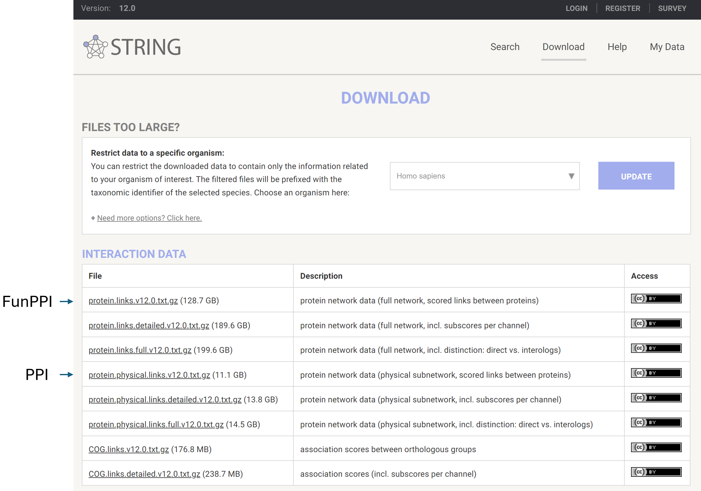

# Protein-Protein Interaction (PPI) data

In the current version of the portal, protein interaction network data is curated from STRING database and ConsensPathDB. The network in the network visualization page is constructed based on the PPI or FunPPI (Functional PPI) data.

<figure><figcaption>
Source of PPI and FunPPI
</figcaption></figure>
