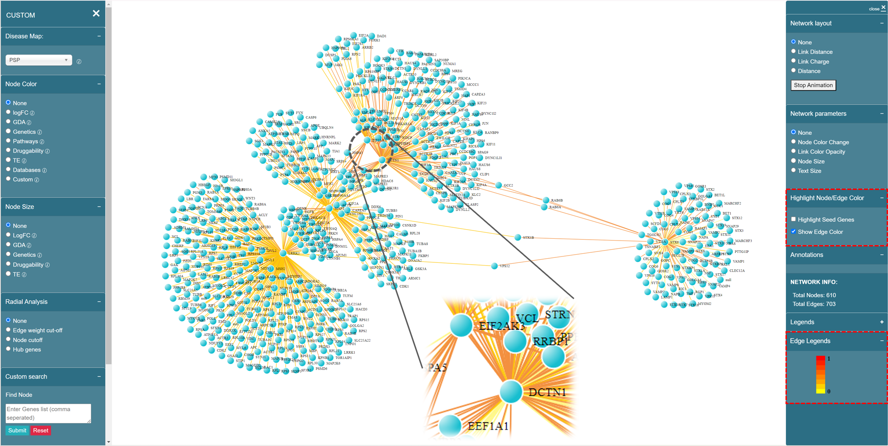
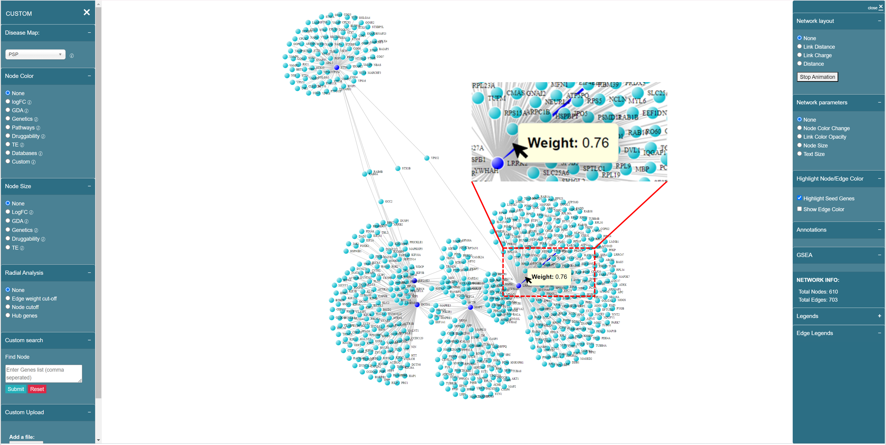

# Network Visualization

Right now you enter the network visualization page, shown as below, where you can analyze your network based on your selections on [Dashboard](../dashboard/).

<figure><figcaption>
Network visualization page
</figcaption></figure>

### Property of seed genes&#x20;

If you focus on the network visualization board, you will first notice that the seed genes (nodes) you provided on the Dashboard are highlighted as dark blue, by default. You can uncheck "Highlight Seed Genes" any time on the right panel to hide the color of seed genes.

<figure><figcaption></figcaption></figure>

### Property of interactions

The interactions (edges) can be colored following the heat map color palette, i.e. the more yellow-ish color indicates the smaller interaction score (edge weight), the more red-ish color indicates the larger interaction score. You can also check "Edge Legends" section on the bottom of the right panel.

Similarly, you can change this property on the right panel by checking/unchecking the "Show Edge Color" in the "Highlight Node/Edge Color" section.

<figure><figcaption></figcaption></figure>

### Gene information

If you hover on an arbitrary gene (node), you are able to see the corresponding gene information.

<figure><figcaption>
Gene information showing up while hovering the node
</figcaption></figure>

### Interaction information

If you hover on an arbitrary interaction (edge), you are able to see the corresponding weight.

<figure><figcaption></figcaption></figure>

The network visualization page also contains the [Left panel](left-panel.md) and [Right panel](right-panel.md) -- Left panel focuses on the functions related to basic analysis of the network, while Right panel focuses on the advanced analysis functions and modifications of inherent network parameters.
