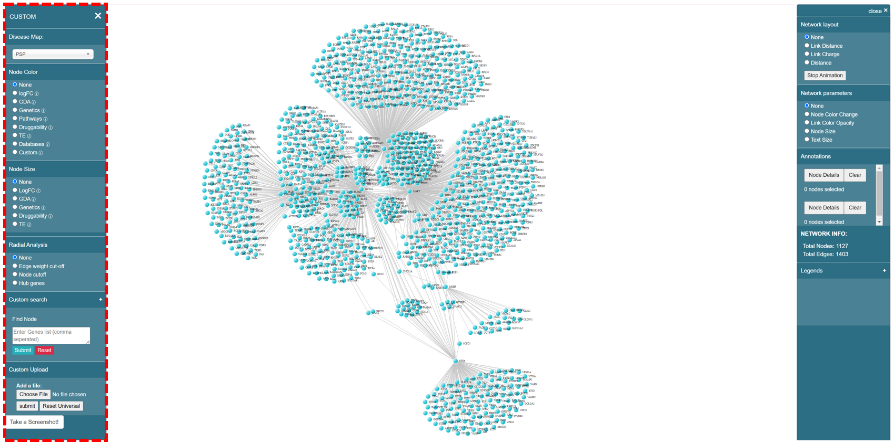
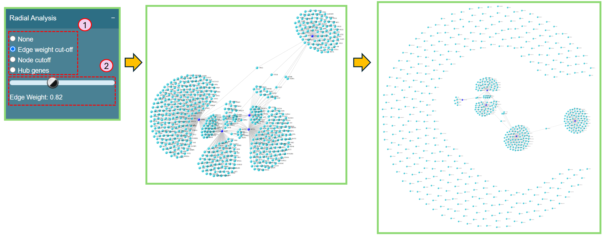
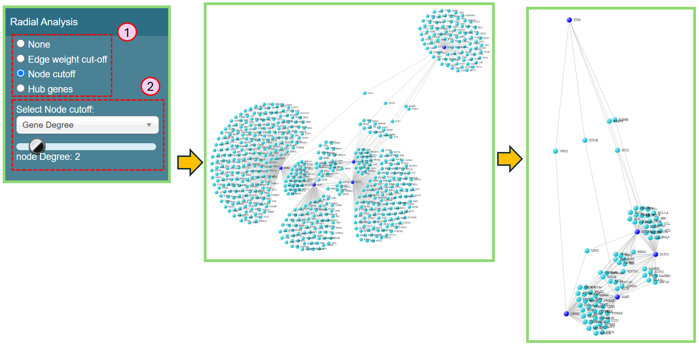
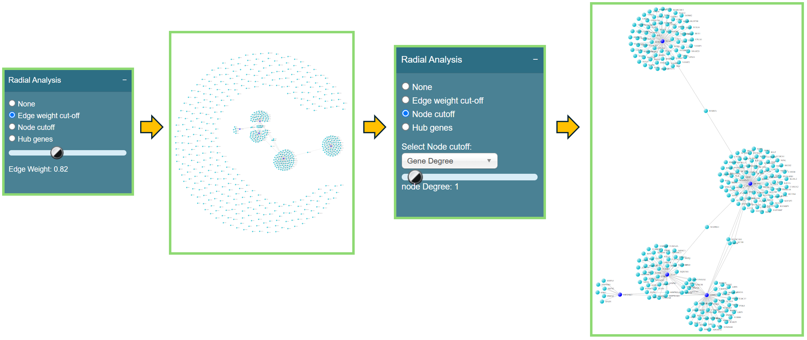
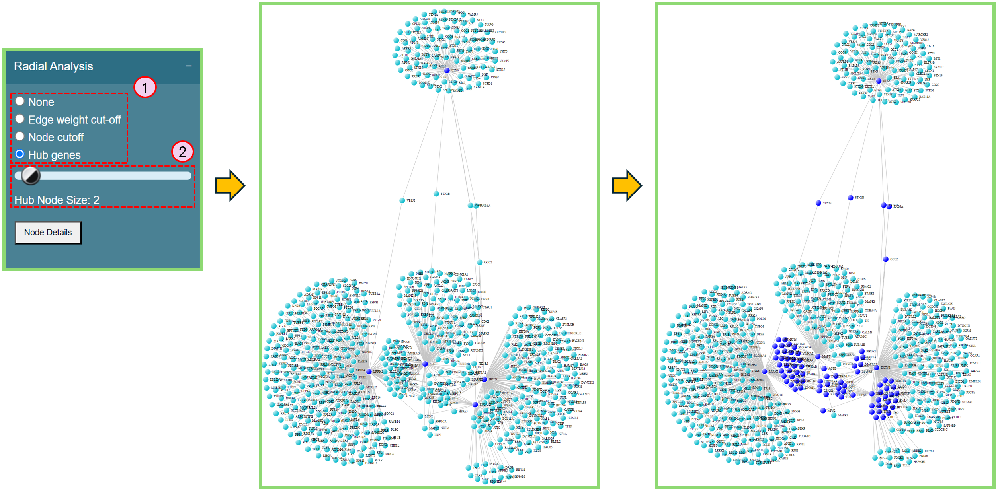

# Left panel

Once you decide the details of your own network, the network visualization page will show up for basic analysis purpose as below.

<figure><figcaption>
Left panel of network visualization page
</figcaption></figure>

Before going over the functions on the left panel, you might want to have some basic understandings of the data available in our tool.&#x20;

[Knowledge Base](../knowledge-base/) integrated in our tool is build based on [disease-dependent data](../knowledge-base/disease-dependent-data/) and [disease-independent data](../knowledge-base/disease-independent-data/). Disease-dependent data indicates the data of specific features varies based on different diseases, while disease-independent data indicates the data remains the same once the disease changes.

Disease-dependent data includes [LogFC](../knowledge-base/disease-dependent-data/logfc.md), [GDA ](../knowledge-base/disease-dependent-data/gda.md)and [Genetics](../knowledge-base/disease-dependent-data/genetics.md), while disease-independent data includes [Pathway](../knowledge-base/disease-independent-data/pathway.md), [Druggability](../knowledge-base/disease-independent-data/druggability.md), [Tissue Enrichment](../knowledge-base/disease-independent-data/tissue-enrichment.md) and [Database](../knowledge-base/disease-independent-data/database.md). We also call these data types as **features**.

### Disease Map

Sometimes you may want to switch to another disease after generating the network visualization, no need to go back to the Dashboard to change the disease and re-render the network, here is a simple way to do it:

* Locate **Disease Map** on the top of the left panel and select the disease name that you want to switch to. You can hover on the info icon  to check the full name of the selected disease.
* Please note that only the [disease-dependent data](../knowledge-base/disease-dependent-data/) will change if you switch to another disease.

<figure><figcaption>
Disease Map
</figcaption></figure>

### Change Node Color

You can change the node color by selecting different features.

1.  Choose a feature.&#x20;

    **Note**: You can hover on the info icon  to check the explanation.
2. Select the preferred option for that feature in the dropdown list. You can type the keyword in the search bar to help locate the data name.

<figure><figcaption>
Change node color
</figcaption></figure>

### Change Node Size

You can change the node size by selecting a feature.&#x20;

1.  Choose a feature.&#x20;

    **Note**: You can hover on the info icon  to check the explanation.
2. Select the preferred data for that feature in the dropdown list. You can type the keyword in the search bar to help locate the data name.

<figure><figcaption>
Change node size
</figcaption></figure>

We provide less features in Node Size section simply because the features Pathway and Database are binary features -- either a gene exists in a pathway/database or they do not exist. However, to change the node size in a network, we need consistent data instead of the binary data.

### Combination of both Node Color and Node Size Change

Node color and node size can be both changed at the same time to highlight the corresponding genes, making them clearer.&#x20;

<figure><figcaption>
Change both node color and node size
</figcaption></figure>

### Radial Analysis

You can reduce the network complexity by selecting different radio buttons here.

* **Edge weight cut-off**

This feature allows you to filter out the nodes with less edge weight, so that you can focus more on the clustered nodes.

1. In the Radial Analysis section, select Edge weight cut-off.&#x20;
2. Use the range slider to select an appropriate value and filter out the nodes with edge weight less than the selected value.

<figure><figcaption>
Edge weight cut-off
</figcaption></figure>

* **Node cutoff**

This feature allows you to shrink the network based on the node degree of specific features.

1. In the Radial Analysis section, select Node cutoff.&#x20;
2. In the dropdown list, you can select your preferred feature and use the range slider to select an appropriate degree, making the network reduced as you want.

<figure><figcaption>
Node cutoff
</figcaption></figure>

* **Combination of Edge weight cut-off and Node cutoff**

You can first use Edge weight cut-off to filter out the nodes with less edge weight, then go to the Node cutoff and slide the value of node degree to 1. In this case, the desired clusters will stand out clearly.

<figure><figcaption>
Combination of Edge weight cut-off and Node cutoff
</figcaption></figure>

* **Hub genes**

Hub genes will highlight the nodes only with larger or equal to the number of edges defined by yourself. **Note**: before using this function, please make sure you've unchecked "Highlight Seed Genes" in the right panel.

1. In the Radial Analysis section, select Hub genes.&#x20;
2. Use the range slider to select an appropriate value to highlight the nodes with node degrees more than or equal to the selected value.

<figure><figcaption>
Hub genes
</figcaption></figure>

### Custom Search

You can find nodes in the network.&#x20;

1. Locate the **Find Node** search box.
2. Enter the gene names or Ensemble IDs into the search box.
3. Click Submit, then the nodes you are looking for will show in yellow.

<figure><figcaption>
Custom search
</figcaption></figure>

### Custom Upload

You can upload your own customized data to analyze the network, instead of using the existing data.

1. Upload a **CSV** file with your own data, please refer to the [File Format](left-panel.md#file-format) below.
2. Click Submit.
3. Locate Node Color section and select the corresponding feature name.
4. Select the column name of your customized data.

#### File Format

* The table below elaborates the naming convention, and the value ranges for all the supported features (data types).&#x20;
  * "Custom" data type is for customized color purpose. For example, if you find all the features do not fit your needs, you can create your own "customized feature" and color them by yourself.

<table><thead><tr><th width="189">Data Type</th><th>Column Naming Convention</th><th>Value range</th></tr></thead><tbody><tr><td>LogFC</td><td>logFC<mark style="color:red;">_CustomName</mark></td><td>[-Inf, +Inf]</td></tr><tr><td>GDA</td><td>GDA<mark style="color:red;">_CustomName</mark></td><td>[0, 1]</td></tr><tr><td>Genetics</td><td>GWAS<mark style="color:red;">_CustomName</mark></td><td>[-1, 1]</td></tr><tr><td>Pathway</td><td>pathway<mark style="color:red;">_CustomName</mark></td><td>binary</td></tr><tr><td>Druggability</td><td>druggability<mark style="color:red;">_CustomName</mark></td><td>[0, 1]</td></tr><tr><td>Tissue Enrichment</td><td>TE<mark style="color:red;">_CustomName</mark></td><td>[0, +Inf]</td></tr><tr><td>Database</td><td>database<mark style="color:red;">_CustomName</mark></td><td>binary</td></tr><tr><td>Custom</td><td>custom_color<mark style="color:red;">_CustomName</mark></td><td>red, green, blue, orange, yellow, black</td></tr></tbody></table>

* The CSV file below provides an example of what the real file looks like.

<figure><figcaption>
Example of custom file format
</figcaption></figure>
