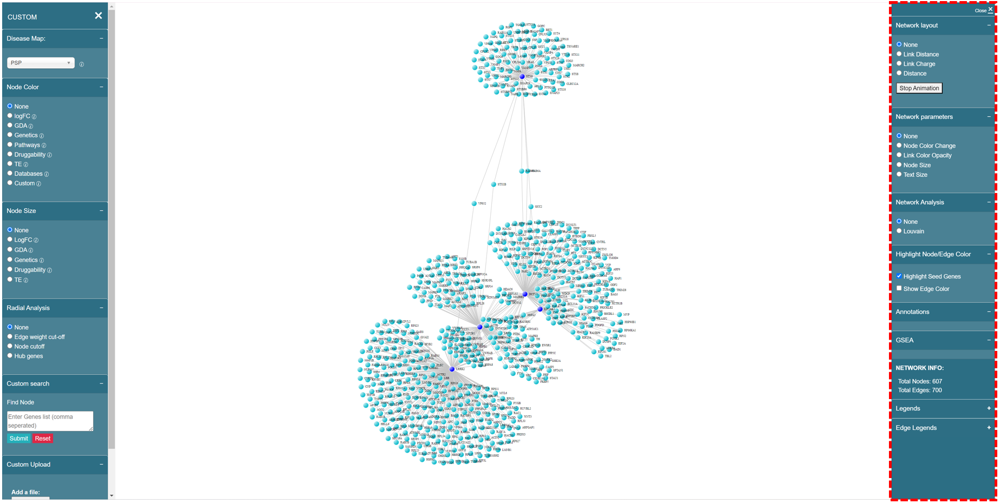

# Right panel

Now we will focus on the functions of right panel.

<figure><figcaption>
Right panel of network visualization page
</figcaption></figure>

### Network Layout

### Network Parameters

### Network Analysis

### Annotations

### GESA

### Louvain

### Network Info

### Legends

